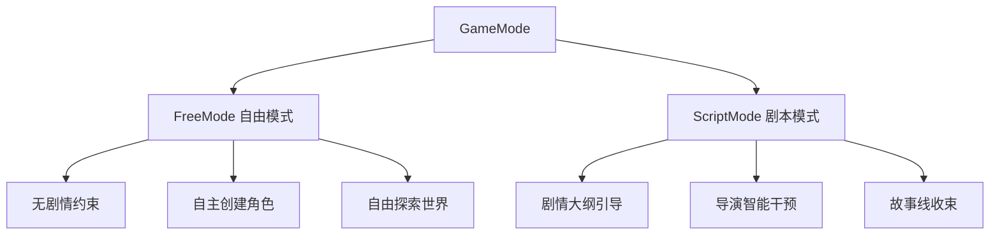
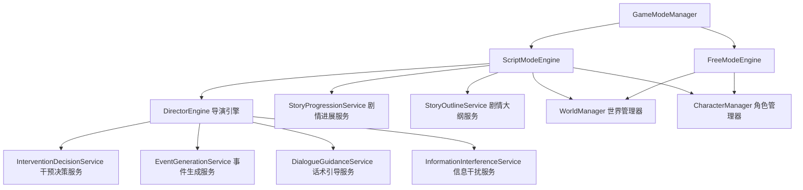
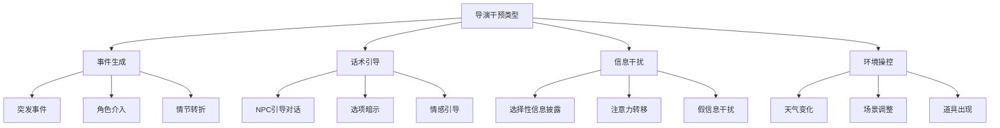
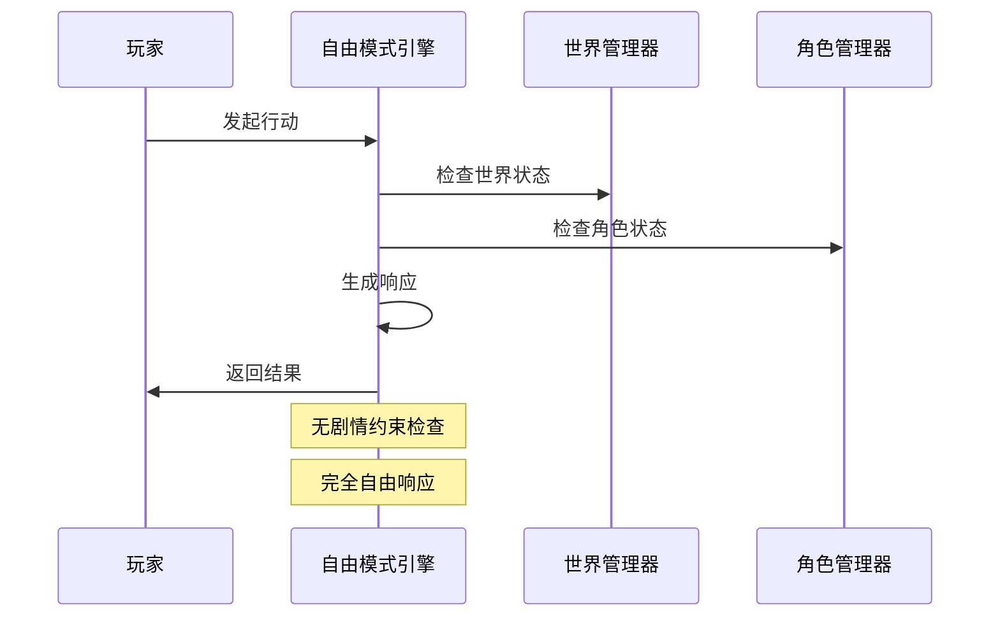
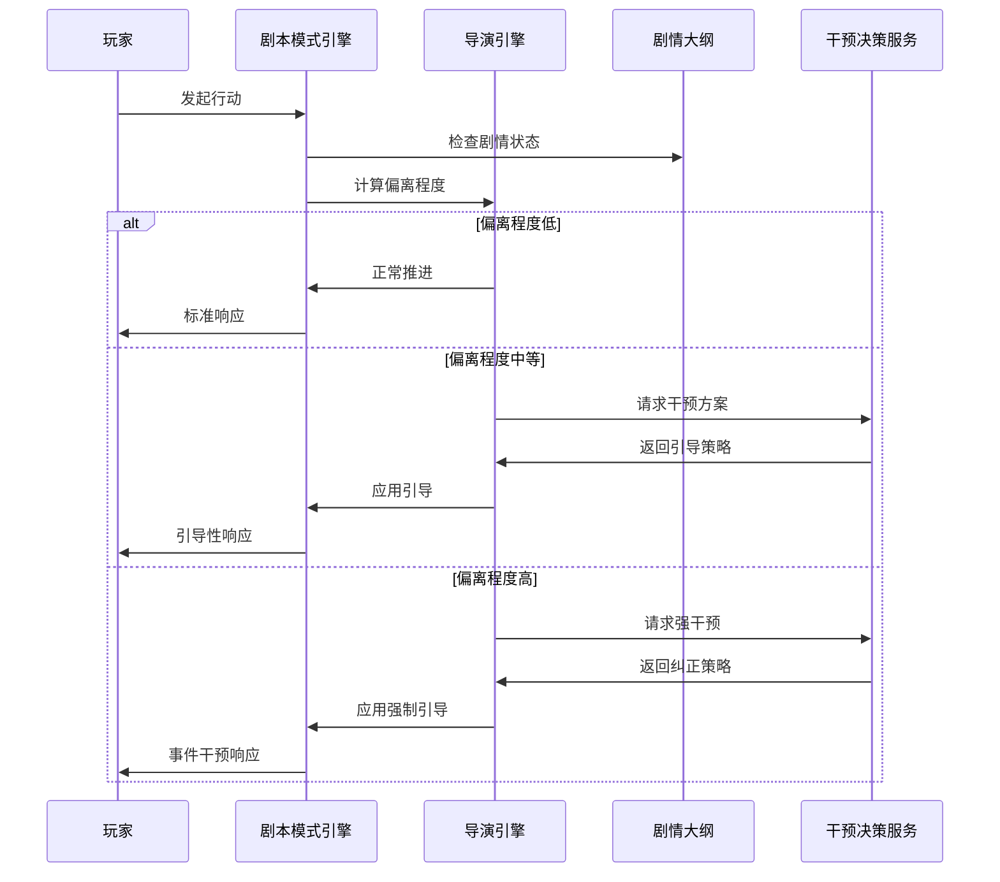
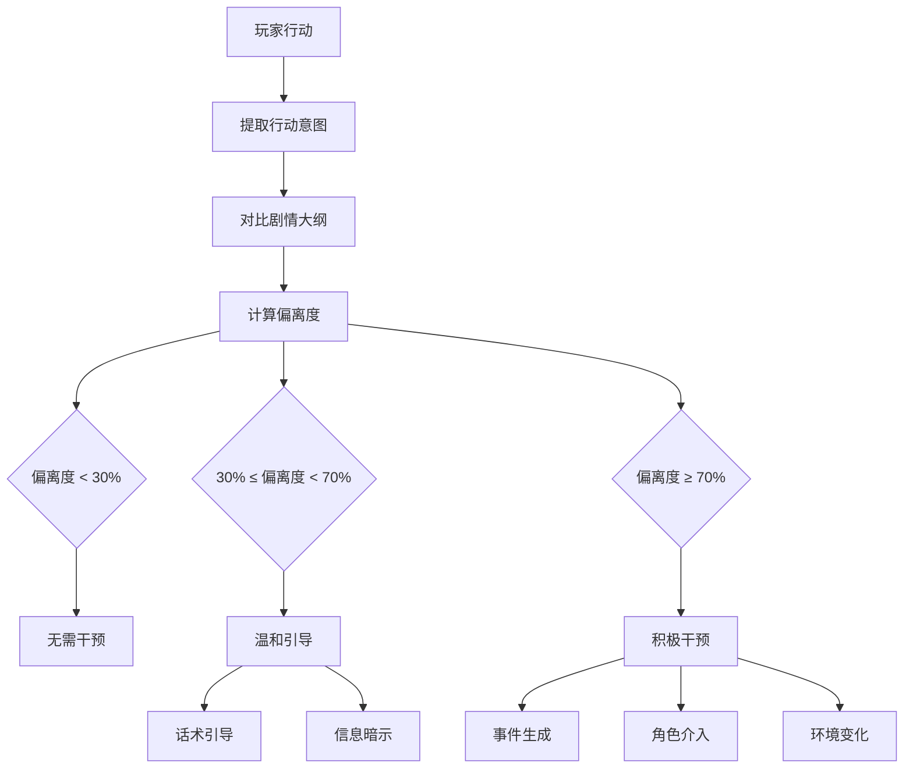
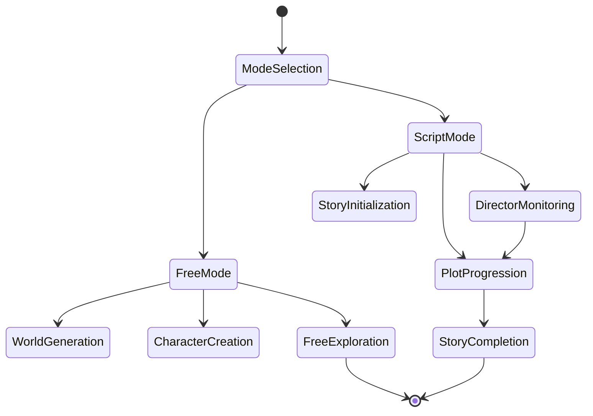
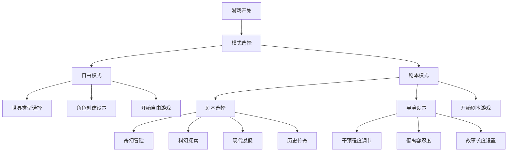
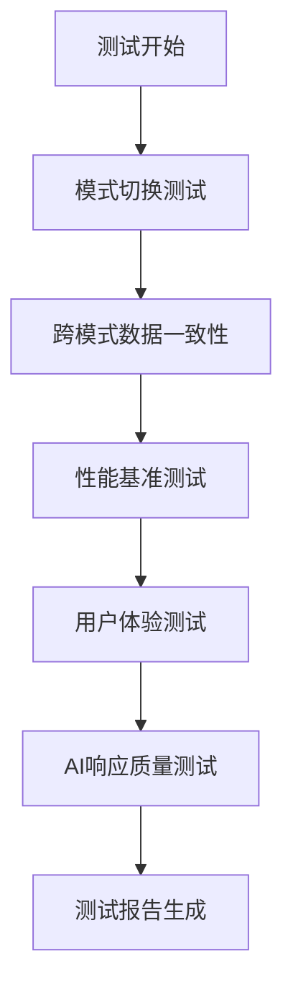

# 游戏模式系统设计

## 概述

本设计定义了一个包含两种主要游戏模式的系统：**自由模式**和**剧本模式**。系统核心在于保证用户选择的无限自由性，同时通过智能导演系统在剧本模式中引导玩家体验完整的故事线。

## 架构设计

### 游戏模式枚举定义



### 系统组件关系



## 数据模型

### 游戏模式配置

| 字段 | 类型 | 描述 |
|------|------|------|
| mode | GameModeType | 游戏模式类型 |
| sessionId | string | 会话标识 |
| worldSeed | string | 世界生成种子 |
| playerPreferences | PlayerPreferences | 玩家偏好设置 |
| modeSpecificConfig | ModeConfig | 模式特定配置 |

### 自由模式配置

| 字段 | 类型 | 描述 |
|------|------|------|
| worldGenerationType | string | 世界生成类型 |
| characterCreationEnabled | boolean | 是否允许创建角色 |
| locationAccessLevel | string | 位置访问权限级别 |
| eventRandomness | number | 随机事件频率 |

### 剧本模式配置

| 字段 | 类型 | 描述 |
|------|------|------|
| storyOutlineId | string | 剧情大纲ID |
| directorInterventionLevel | number | 导演干预程度(0-100) |
| storyDeviationTolerance | number | 剧情偏离容忍度(0-100) |
| targetStoryLength | number | 目标故事长度 |
| keyPlotPoints | PlotPoint[] | 关键剧情节点 |

### 剧情大纲结构

| 字段 | 类型 | 描述 |
|------|------|------|
| id | string | 大纲唯一标识 |
| title | string | 故事标题 |
| genre | string | 故事类型 |
| acts | StoryAct[] | 故事章节 |
| characters | StoryCharacter[] | 剧本角色 |
| locations | StoryLocation[] | 剧本地点 |
| themes | string[] | 故事主题 |

### 导演干预类型



## 核心功能设计

### 1. 游戏模式管理器

```typescript
interface GameModeManager {
  // 模式切换
  switchMode(newMode: GameModeType, config: ModeConfig): Promise<void>
  
  // 获取当前模式
  getCurrentMode(): GameModeType
  
  // 验证模式配置
  validateModeConfig(config: ModeConfig): boolean
  
  // 获取模式状态
  getModeState(): GameModeState
}
```

### 2. 自由模式引擎

#### 特性
- **无剧情约束**：不设定固定剧情线，允许玩家完全自由发挥
- **动态世界生成**：根据玩家行为动态生成新的地点和角色
- **开放式创作**：支持玩家创建自定义角色和场景
- **随机事件系统**：基于玩家行为和环境生成随机事件

#### 核心机制


### 3. 剧本模式引擎

#### 特性
- **剧情大纲引导**：根据预设的故事大纲推进剧情
- **智能导演系统**：监控玩家选择并进行适当干预
- **偏离检测**：实时检测玩家行为是否偏离剧情主线
- **无感干预**：通过自然的方式引导玩家回到预设轨道

#### 核心流程


### 4. 导演引擎详细设计

#### 偏离度计算算法


#### 干预策略矩阵

| 偏离程度 | 干预类型 | 干预强度 | 实施方式 |
|----------|----------|----------|----------|
| 0-30% | 无干预 | 0% | 自然推进 |
| 30-50% | 信息引导 | 25% | 对话暗示、选项调整 |
| 50-70% | 事件引导 | 50% | 生成相关事件、NPC介入 |
| 70-85% | 强制引导 | 75% | 环境限制、强制事件 |
| 85-100% | 紧急纠正 | 100% | 剧情重置、直接干预 |

### 5. 干预技术实现

#### 事件生成服务
- **突发事件**：创建与剧情相关的紧急情况
- **角色介入**：让关键NPC出现并引导对话
- **环境事件**：通过环境变化影响玩家决策

#### 话术引导服务
- **选项优化**：调整选择项的表述和顺序
- **情感引导**：通过NPC情感表达影响玩家
- **信息披露**：选择性提供关键信息

#### 信息干扰服务
- **注意力转移**：通过其他事件分散注意力
- **假信息注入**：提供误导性信息引导回归
- **信息缺失**：暂时隐藏某些关键信息

## 状态管理

### 游戏模式状态



### 剧情进展跟踪

| 字段 | 类型 | 描述 |
|------|------|------|
| currentAct | number | 当前章节 |
| completedPlotPoints | string[] | 已完成的剧情点 |
| activeQuests | Quest[] | 活跃任务 |
| storyFlags | Record<string, boolean> | 故事标记 |
| deviationHistory | DeviationRecord[] | 偏离历史记录 |
| interventionHistory | InterventionRecord[] | 干预历史记录 |

## 用户交互设计

### 模式选择界面



### 实时状态显示

#### 自由模式界面元素
- 当前位置信息
- 角色状态面板
- 世界探索进度
- 随机事件提示

#### 剧本模式界面元素
- 故事进度条
- 当前章节信息
- 剧情偏离指示器（仅调试模式显示）
- 关键选择提示

## 测试策略

### 自由模式测试

#### 功能测试
- 世界生成完整性测试
- 角色创建功能测试
- 位置连接正确性测试
- 随机事件触发测试

#### 性能测试
- 大型世界渲染性能
- 大量角色管理性能
- 长时间游戏稳定性

### 剧本模式测试

#### 故事完整性测试
- 剧情大纲执行完整性
- 关键剧情点触发准确性
- 结局达成条件验证

#### 导演系统测试
- 偏离度计算准确性
- 干预决策合理性
- 引导效果评估

#### 边界情况测试
- 极端偏离行为处理
- 系统性能极限测试
- 异常输入处理

### 集成测试场景



## 性能优化

### 内存管理
- 世界数据分块加载
- 角色状态缓存优化
- 剧情大纲预加载

### 计算优化
- 偏离度计算缓存
- LLM请求批处理
- 事件生成异步处理

### 响应时间优化
- 预测性内容生成
- 智能缓存策略
- 渐进式内容加载