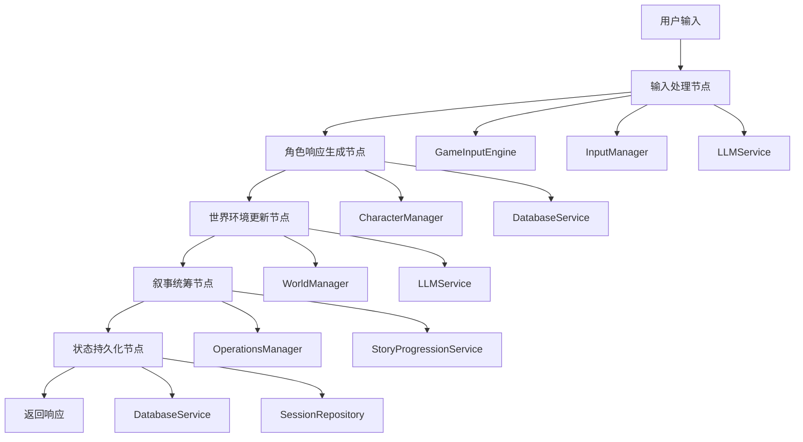
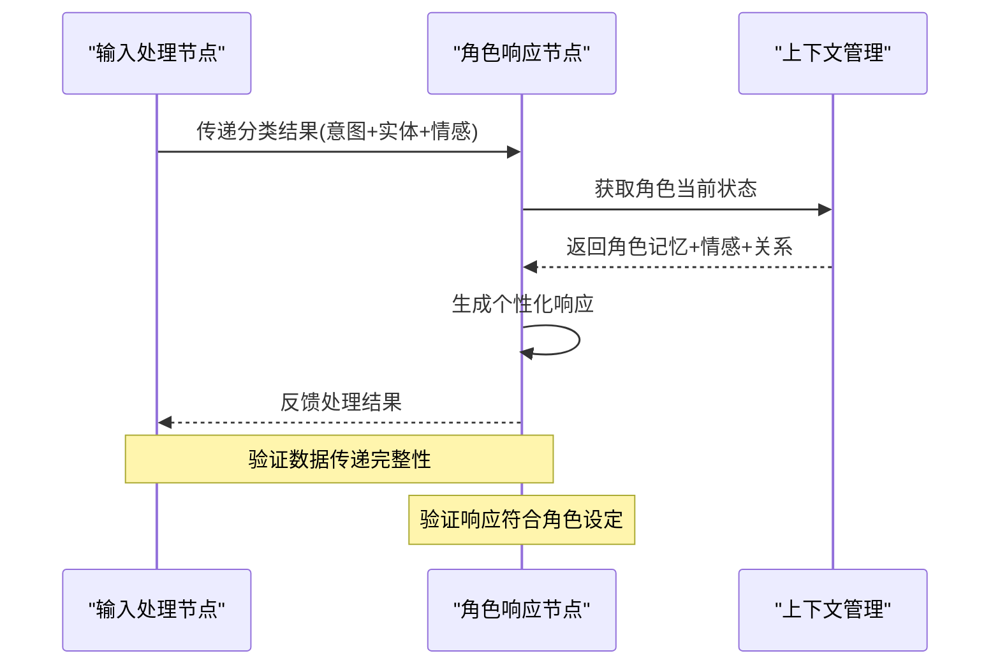
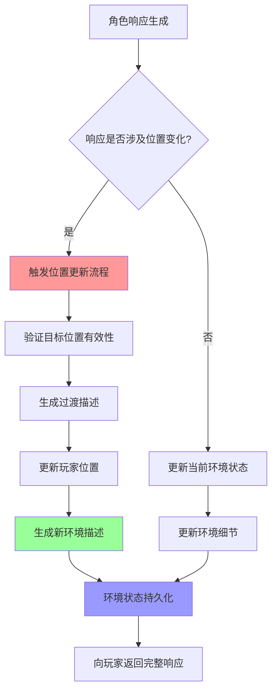
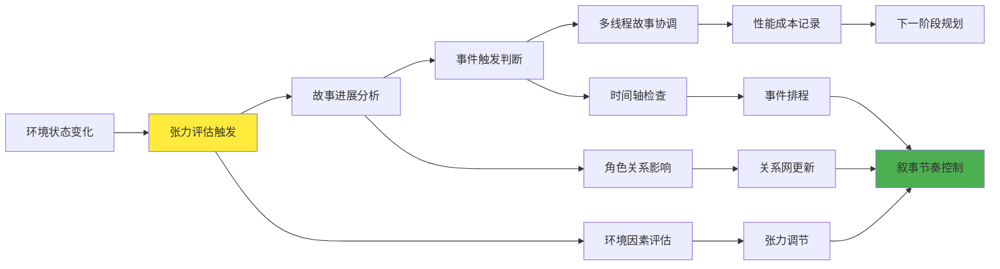

# 游戏系统节点排查计划与任务清单

## 概述

基于游戏循环的5个核心节点，建立系统性的排查计划，检测各组件的集成情况和代码质量，验证是否符合工程规范。

## 游戏循环架构图



## 节点1：输入处理节点排查清单

### 1.1 核心功能检查
| 功能模块 | 检查项目 | 功能要求 | 状态 | 验证标准 |
|----------|----------|----------|------|----------|
| 输入预处理引擎 | 文本规范化与清洗 | 能够处理各种格式的用户输入，去除无效字符，统一编码格式 | ⬜ | 输入"Hello! @#$"输出规范化文本 |
| 输入分类系统 | 意图识别与分类 | 准确识别用户输入的意图类型（对话、移动、动作、查询等） | ⬜ | 分类准确率>85% |
| 实体提取服务 | 命名实体识别 | 从输入中提取人物、地点、物品等关键实体信息 | ⬜ | 能识别角色名、位置名、物品名 |
| 情感分析模块 | 情感状态检测 | 分析用户输入的情感倾向（积极、消极、中性） | ⬜ | 情感分析准确率>80% |
| LLM集成层 | 多模型协调 | 支持多种LLM提供商，具备故障转移和负载均衡 | ⬜ | 主模型失败时自动切换 |

### 1.2 功能实现验证
- [ ] **文本预处理能力**：能够处理各种编码、特殊字符、emoji等复杂输入
- [ ] **意图分类准确性**：对常见游戏操作意图分类准确率达到85%以上
- [ ] **实体提取完整性**：能够识别游戏世界中的角色、地点、物品等核心实体
- [ ] **情感分析精确性**：准确捕获用户输入的情感色彩，为角色响应提供依据
- [ ] **LLM服务稳定性**：支持多模型切换，具备重试机制和降级策略
- [ ] **响应时间控制**：简单输入处理时间控制在500ms内，复杂输入在1500ms内

### 1.3 工程规范检查
- [ ] TypeScript类型定义完整，无any类型滥用
- [ ] 错误处理机制完善，包含重试和降级策略
- [ ] 日志记录符合结构化要求
- [ ] 单元测试覆盖核心逻辑路径

### 1.4 性能指标验证
- [ ] 简单输入处理时间 < 800ms
- [ ] 复杂输入处理时间 < 1800ms
- [ ] 内存使用稳定，无明显泄漏
- [ ] LLM调用成本监控正常

## 节点2：角色响应生成节点排查清单

### 2.1 核心功能检查
| 功能模块 | 检查项目 | 功能要求 | 状态 | 验证标准 |
|----------|----------|----------|------|----------|
| 角色个性系统 | 个性化对话生成 | 根据角色设定生成符合个性的独特对话风格 | ⬜ | 同一输入不同角色响应差异明显 |
| 记忆管理系统 | 长短期记忆处理 | 维护角色的短期对话记忆和长期经历记忆 | ⬜ | 能回忆之前的对话和事件 |
| 情感状态系统 | 动态情感变化 | 角色情感随互动变化，影响对话内容和态度 | ⬜ | 情感变化自然且有逻辑 |
| 关系网络系统 | 角色间关系管理 | 维护角色与玩家及其他NPC的关系状态 | ⬜ | 关系变化影响互动方式 |
| 对话生成引擎 | 上下文相关对话 | 基于当前情境、历史和关系生成合适对话 | ⬜ | 对话内容连贯且符合语境 |
| 角色状态持久化 | 数据一致性保证 | 确保角色状态变化及时准确地保存和恢复 | ⬜ | 重启后角色状态保持一致 |

### 2.2 功能实现验证
- [ ] **个性一致性**：角色在不同对话中保持一致的个性特征和说话风格
- [ ] **记忆连贯性**：能够引用之前的对话内容，保持记忆的时间顺序
- [ ] **情感真实性**：情感变化有合理的触发条件，变化过程自然
- [ ] **关系敏感性**：对话内容会根据与玩家的关系亲密度调整
- [ ] **上下文感知**：响应内容与当前场景、时间、事件相关
- [ ] **数据持久性**：角色状态修改后能够正确保存和读取

### 2.3 领域驱动设计(DDD)规范检查
- [ ] character域包含valueObjects、entities、services、aggregates模块
- [ ] 实体和值对象定义清晰，符合领域模型
- [ ] 聚合根正确封装业务逻辑
- [ ] 领域服务不包含基础设施关注点

### 2.4 AI集成质量检查
- [ ] LLM提示模板包含必要的上下文信息
- [ ] 角色个性在对话中体现一致性
- [ ] 情感状态正确影响响应生成
- [ ] 记忆系统支持长期和短期记忆

## 节点3：世界环境更新节点排查清单

### 3.1 核心功能检查
| 功能模块 | 检查项目 | 功能要求 | 状态 | 验证标准 |
|----------|----------|----------|------|----------|
| 世界状态管理 | 环境状态追踪 | 实时维护游戏世界的完整状态信息 | ⬜ | 世界状态变化及时反映 |
| 位置系统 | 空间导航管理 | 处理玩家在游戏世界中的位置移动和空间关系 | ⬜ | 位置切换流畅无冲突 |
| 动态场景生成 | 环境描述创建 | 根据当前状态生成生动的环境描述 | ⬜ | 描述内容丰富且符合情境 |
| 环境交互系统 | 物理交互处理 | 处理玩家与环境物体的交互操作 | ⬜ | 交互结果符合物理逻辑 |
| 时间系统 | 时间流逝管理 | 管理游戏内时间的流逝和相关事件触发 | ⬜ | 时间相关事件按时触发 |
| 环境持久化 | 世界状态保存 | 确保环境变化能够持久保存和恢复 | ⬜ | 环境状态重启后保持 |

### 3.2 功能实现验证
- [ ] **位置准确性**：玩家位置信息准确，包含详细的空间描述
- [ ] **移动流畅性**：位置切换提供平滑的过渡体验和引导信息
- [ ] **环境一致性**：同一位置在不同时间访问保持基本特征一致
- [ ] **动态性**：环境描述会根据时间、天气、事件等因素动态变化
- [ ] **交互响应性**：环境中的可交互对象能够正确响应玩家操作
- [ ] **状态同步性**：多玩家环境下世界状态在所有客户端保持同步

### 3.3 环境描述生成检查
- [ ] LLM生成的环境描述与游戏状态一致
- [ ] 动态位置生成避免硬编码逻辑
- [ ] 环境描述包含足够的沉浸感要素
- [ ] 位置变更触发正确的叙事事件

### 3.4 world域DDD规范检查
- [ ] world域结构完整，包含所需的四个模块
- [ ] 位置实体正确建模，包含必要属性
- [ ] 世界状态聚合正确管理复杂状态变更
- [ ] 位置服务符合领域服务设计原则

## 节点4：叙事统筹节点排查清单

### 4.1 核心功能检查
| 功能模块 | 检查项目 | 功能要求 | 状态 | 验证标准 |
|----------|----------|----------|------|----------|
| 故事进展管理 | 剧情推进控制 | 根据玩家行为和选择推进故事发展 | ⬜ | 故事分支自然合理 |
| 张力评估系统 | 情节张力控制 | 动态评估和调整故事的紧张程度 | ⬜ | 张力变化符合叙事节奏 |
| 事件触发机制 | 剧情事件管理 | 在合适时机触发预设或动态生成的剧情事件 | ⬜ | 事件触发时机恰当 |
| 多线程叙事 | 并行故事线管理 | 管理多个同时进行的故事线和角色线 | ⬜ | 故事线间无逻辑冲突 |
| 性能监控系统 | 系统性能追踪 | 实时监控各组件性能和资源使用情况 | ⬜ | 性能数据准确完整 |
| 成本控制系统 | 资源消耗管理 | 监控和控制LLM调用等资源消耗 | ⬜ | 成本控制在预算范围内 |

### 4.2 功能实现验证
- [ ] **剧情连贯性**：故事发展逻辑清晰，前后情节连贯一致
- [ ] **张力适宜性**：故事张力变化符合玩家期望和叙事规律
- [ ] **事件合理性**：触发的事件与当前情境和玩家行为相关
- [ ] **多线平衡性**：多个故事线能够平衡发展，避免冲突
- [ ] **性能可见性**：关键性能指标实时可见，异常及时告警
- [ ] **成本透明性**：资源消耗情况清晰可追踪，支持优化决策

### 4.3 故事进展管理检查
- [ ] `StoryProgressionService.evaluateTriggerableEvents()`正确评估事件
- [ ] 剧情事件触发逻辑与玩家行为关联
- [ ] 故事分支管理支持多种叙事路径
- [ ] 张力系统正确影响故事走向

### 4.4 operations域协调功能检查
- [ ] operations域包含完整的DDD结构
- [ ] 领域协调器正确管理跨域交互
- [ ] 性能聚合正确计算和存储指标
- [ ] 成本追踪服务提供准确的消费统计

## 节点5：状态持久化节点排查清单

### 5.1 核心功能检查
| 功能模块 | 检查项目 | 功能要求 | 状态 | 验证标准 |
|----------|----------|----------|------|----------|
| 会话状态管理 | 游戏会话持久化 | 完整保存和恢复游戏会话的所有状态信息 | ⬜ | 会话中断后可完整恢复 |
| 对话记录系统 | 对话历史存储 | 准确记录所有玩家与NPC的对话内容 | ⬜ | 对话记录完整无遗漏 |
| 角色记忆存储 | 角色状态持久化 | 保存角色的记忆、情感、关系等动态状态 | ⬜ | 角色状态变化及时保存 |
| 世界状态存储 | 游戏世界持久化 | 保存游戏世界的环境、物体、时间等状态 | ⬜ | 世界状态重启后一致 |
| 数据完整性保证 | 事务性操作支持 | 确保关联数据的一致性和完整性 | ⬜ | 操作失败时数据不破坏 |
| 备份恢复机制 | 数据安全保障 | 提供数据备份和灾难恢复能力 | ⬜ | 数据丢失时可快速恢复 |

### 5.2 功能实现验证
- [ ] **数据一致性**：相关数据更新保持原子性，避免部分更新
- [ ] **存储完整性**：所有游戏状态变化都能准确保存到持久化存储
- [ ] **检索效率**：数据查询响应时间满足游戏实时性要求
- [ ] **容错能力**：存储操作失败时有适当的错误处理和重试机制
- [ ] **扩展性**：数据结构支持游戏功能的扩展和演进
- [ ] **安全性**：敏感数据适当加密，访问控制机制完善

### 5.3 数据一致性检查
- [ ] 事务处理确保数据一致性
- [ ] 并发访问控制避免数据竞争
- [ ] 数据备份和恢复机制完善
- [ ] 数据迁移脚本和版本管理

### 5.4 Repository模式规范检查
- [ ] Repository接口定义清晰，职责单一
- [ ] 数据访问逻辑与业务逻辑分离
- [ ] 查询优化和索引策略合理
- [ ] 数据访问层错误处理完善

## 游戏循环联合工作逻辑验证

### 节点间协作流程分析

#### 输入处理→角色响应联合验证



**关键验证点：**
- [ ] **数据传递完整性**：输入分类的所有关键信息都正确传递给角色系统
- [ ] **上下文一致性**：角色响应考虑了完整的历史上下文和当前状态
- [ ] **个性化程度**：相同输入在不同角色/情境下产生明显差异的响应
- [ ] **情感连贯性**：角色情感变化与输入情感和历史互动保持逻辑关系
- [ ] **时间敏感性**：角色响应反映当前的时间、地点、事件背景

#### 角色响应→环境更新联合验证



**关键验证点：**
- [ ] **位置变化检测**：角色响应中的位置变化意图能被正确识别和处理
- [ ] **过渡体验**：位置变化提供流畅的过渡描述和引导信息
- [ ] **环境一致性**：新环境描述与游戏世界设定和逻辑保持一致
- [ ] **状态同步**：环境变化在所有相关系统中同步更新
- [ ] **互动反馈**：环境变化对后续角色行为和故事发展产生影响

#### 环境更新→叙事统筹联合验证



**关键验证点：**
- [ ] **张力响应性**：环境变化能够适当触发故事张力的评估和调整
- [ ] **事件合理性**：触发的剧情事件与当前环境和玩家状态逻辑相关
- [ ] **多线平衡**：多个故事线能够合理平衡发展，避免冲突
- [ ] **节奏控制**：叙事节奏与玩家行为频率和游戏状态匹配
- [ ] **性能监控**：复杂叙事计算不影响游戏流畅性

#### 叙事统筹→状态持久化联合验证

**关键验证点：**
- [ ] **状态完整性**：所有叙事变化都能完整准确地保存到持久化存储
- [ ] **一致性保证**：相关联的状态数据在事务中原子性更新
- [ ] **恢复能力**：系统中断后能够从最后一致状态正确恢复
- [ ] **版本管理**：状态变化支持版本追踪，便于问题诊断
- [ ] **性能平衡**：持久化操作不阻塞游戏主流程的实时响应

### 端到端游戏循环验证

#### 完整流程测试场景

**场景1：简单对话场景**
```
输入："你好，艾莉娅"
预期流程：
1. 输入分类：对话意图 + 角色实体(艾莉娅) + 友好情感
2. 角色响应：基于艾莉娅设定生成个性化问候
3. 环境状态：无变化，维持当前位置
4. 叙事记录：记录对话到关系系统
5. 状态保存：更新对话历史和关系值
```

**场景2：复杂移动场景**
```
输入："我想去图书馆找一些魔法书籍"
预期流程：
1. 输入分类：移动意图 + 位置实体(图书馆) + 目标实体(魔法书籍)
2. 角色响应：NPC提供路线建议或陪同
3. 环境更新：位置从当前→图书馆，生成过渡和新环境
4. 叙事评估：可能触发图书馆相关的故事事件
5. 状态保存：位置、事件进度、相关状态全部更新
```

**场景3：情感冲突场景**
```
输入："你为什么总是对我撒谎？"
预期流程：
1. 输入分类：质疑意图 + 情感冲突(愤怒/失望)
2. 角色响应：根据关系历史和个性生成防御或道歉
3. 环境影响：紧张氛围可能影响周围NPC反应
4. 叙事调整：关系冲突可能触发相关故事分支
5. 状态更新：关系值下降，角色情感状态变化
```

#### 性能与稳定性验证

**压力测试场景：**
- [ ] **并发处理**：多个玩家同时进行复杂操作时系统稳定性
- [ ] **长时间运行**：连续游戏数小时后各组件性能稳定性
- [ ] **资源峰值**：复杂场景下内存和CPU使用是否在合理范围
- [ ] **网络延迟**：高延迟环境下游戏体验的可接受性
- [ ] **故障恢复**：各种故障场景下的恢复能力测试

#### 边界条件验证

**异常输入处理：**
- [ ] **无效输入**：空输入、乱码、过长文本的处理
- [ ] **歧义输入**：多重含义输入的处理和澄清机制
- [ ] **越界操作**：尝试访问不存在位置或角色的处理
- [ ] **冲突状态**：多个操作导致的状态冲突解决
- [ ] **资源限制**：达到系统资源上限时的优雅降级

### 游戏逻辑一致性验证

#### 时间逻辑一致性
- [ ] **时间流逝**：游戏内时间流逝与事件触发的逻辑关系
- [ ] **时序依赖**：依赖时间顺序的事件正确执行
- [ ] **并发时间**：多玩家环境下时间同步的一致性
- [ ] **历史一致**：历史事件记录与当前状态的逻辑一致性

#### 空间逻辑一致性
- [ ] **位置关系**：游戏世界中位置间的逻辑关系正确
- [ ] **移动限制**：移动规则的一致性执行
- [ ] **空间感知**：角色对空间的感知与实际位置匹配
- [ ] **并发位置**：多玩家同时在同一位置的状态一致性

#### 角色逻辑一致性
- [ ] **个性稳定性**：角色个性在不同情况下保持基本稳定
- [ ] **记忆逻辑性**：角色记忆的形成、保持、遗忘符合设定
- [ ] **关系合理性**：角色间关系变化有合理的因果关系
- [ ] **行为一致性**：角色行为与其设定和当前状态一致

#### 故事逻辑一致性
- [ ] **因果关系**：故事事件间有明确的因果逻辑链
- [ ] **时间线一致**：多条故事线在时间轴上无逻辑矛盾
- [ ] **角色参与**：角色在故事中的参与度与其重要性匹配
- [ ] **结果合理性**：故事结果与玩家选择和行为逻辑相关

### 用户体验一致性验证

#### 响应一致性
- [ ] **风格统一**：所有角色响应在文本风格上保持游戏整体调性
- [ ] **质量稳定**：不同时间、不同情况下响应质量保持稳定
- [ ] **个性区分**：不同角色的响应有明显的个性化差异
- [ ] **情境适应**：响应内容适应当前的情境和氛围

#### 交互一致性
- [ ] **操作反馈**：所有用户操作都有明确和及时的反馈
- [ ] **状态可见**：游戏状态变化对用户可见和可理解
- [ ] **错误处理**：错误和异常情况有友好的用户提示
- [ ] **帮助引导**：新用户或复杂操作有适当的引导信息

## 系统集成验证清单

### 依赖管理系统检查
- [ ] **服务注册完整性**：所有核心服务都正确注册到依赖容器中
- [ ] **生命周期管理**：服务的创建、初始化、销毁符合设计要求
- [ ] **循环依赖检测**：能够检测和解决服务间的循环依赖问题
- [ ] **测试支持**：支持测试环境下的服务替换和模拟

### 错误处理与日志系统
- [ ] **结构化日志**：日志记录采用结构化格式，便于搜索和分析
- [ ] **错误分级处理**：不同级别的错误有相应的处理策略和恢复机制
- [ ] **日志级别适当**：日志级别设置合理，支持调试和生产环境
- [ ] **监控告警**：关键错误和异常情况能够及时触发告警通知

### 多人游戏支持验证
- [ ] **实时通信稳定性**：支持多用户并发连接，保证通信稳定
- [ ] **状态同步机制**：游戏状态在所有客户端保持实时同步
- [ ] **玩家会话管理**：玩家的加入、离开、重连功能正常
- [ ] **并发控制机制**：避免多玩家操作导致的状态冲突和数据不一致

## 工程质量整体评估

### 代码质量指标
- [ ] **TypeScript类型安全**：严格的TypeScript配置，避免any类型滥用
- [ ] **测试覆盖率**：单元测试覆盖率达到70%以上，核心逻辑達到90%
- [ ] **静态代码分析**：使用ESLint/Prettier等工具，无严重警告
- [ ] **代码风格一致**：命名、格式、注释符合团队规范

### 架构质量评估
- [ ] **模块化设计**：组件间低耦合高内聚，职责单一明确
- [ ] **接口设计**：接口定义清晰，符合开闭原则和依赖倒置
- [ ] **设计模式**：设计模式使用恰当，避免过度设计和欠设计
- [ ] **可扩展性**：系统架构支持新功能的扩展和已有功能的修改

### 性能和安全检查
- [ ] **关键路径性能**：游戏响应时间满足用户体验要求
- [ ] **内存使用优化**：无内存泄漏，垃圾回收无异常压力
- [ ] **API密钥管理**：敏感信息安全存储，符合安全规范
- [ ] **输入验证安全**：所有用户输入都经过适当的验证和清洗

## 排查执行计划

### 阶段1：基础组件验证（1-2天）
1. 检查所有核心组件的文件存在性和基本结构
2. 验证TypeScript编译和基础类型定义
3. 运行现有单元测试，识别失败用例
4. 检查依赖注入容器的服务注册

### 阶段2：节点功能验证（3-5天）
1. 按游戏循环顺序逐节点验证功能
2. 测试关键接口的输入输出正确性
3. 验证错误处理和边界条件
4. 检查性能指标是否满足要求

### 阶段3：集成测试验证（2-3天）
1. 端到端游戏流程测试
2. 多用户并发场景测试
3. 异常情况和恢复能力测试
4. 性能压力测试和优化

### 阶段4：代码质量审查（1-2天）
1. 代码审查和静态分析
2. 技术债务识别和优化建议
3. 文档完整性检查
4. 部署和运维准备验证

## 风险识别与缓解

### 高风险功能项目
- **数据库服务实现不完整**：数据库服务缺少自动初始化功能和完整实现
- **系统复杂度过高**：部分组件功能交叉重叠，需要简化和重构
- **服务集成不完整**：部分服务实现但未集成到主游戏流程
- **功能重复实现**：输入分类等关键功能在多处重复实现

### 缓解策略
- **优先修复数据库服务**：确保基础设施稳定，支持数据持久化需求
- **简化系统架构**：专注核心功能，减少不必要的复杂性
- **清理未使用的服务**：提高代码可维护性和系统可理解性
- **合并重复功能**：建立统一接口，减少功能冲突和维护成本

## 成功标准

### 功能完整性
- [ ] 所有游戏循环节点功能正常
- [ ] 端到端用户流程无阻塞问题
- [ ] 多用户协作功能稳定

### 性能达标
- [ ] 简单交互响应时间 < 800ms
- [ ] 复杂交互响应时间 < 1800ms
- [ ] 系统资源使用合理

### 工程质量
- [ ] 代码覆盖率 > 70%
- [ ] 静态分析无严重问题
- [ ] 架构设计符合DDD原则

## 后续优化建议

### 技术债务清理
1. 移除或重构未使用的组件
2. 统一重复功能的实现
3. 完善数据库服务的实现
4. 优化Agent系统的复杂度

### 功能增强
1. 增强性能监控和告警系统
2. 完善用户体验反馈机制
3. 扩展AI模型的多样性支持
4. 优化长期记忆存储和检索