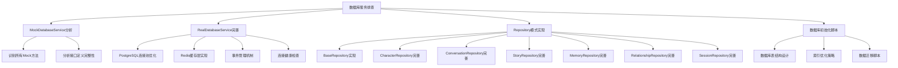
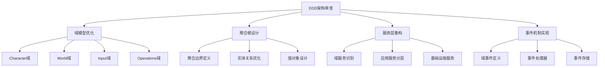

# AI角色驱动开放世界游戏项目排查计划与任务清单

## 概述

基于对项目代码的全面分析，发现了大量模拟实现、硬编码测试数据、定义重复、接口不完善等问题。本文档制定了详细的排查计划和任务清单，确保项目的全面优化和完善。

## 问题分类与优先级

### 🔴 严重问题（P0 - 紧急处理）
1. **Mock服务大量存在**：核心服务存在Mock实现，影响功能完整性
2. **数据持久化缺失**：数据库操作多为空实现，数据无法真正持久化
3. **LLM集成不完整**：多个LLM提供者存在Mock实现
4. **DomainCoordinator占位实现**：DomainCoordinator等核心逻辑文件中存在占位实现，影响功能完整性

### 🟡 重要问题（P1 - 高优先级）
1. **硬编码测试数据**：业务逻辑中存在大量硬编码数据
2. **接口定义重复**：多处存在相同或相似的接口定义，如input classification和intent classification
3. **架构不一致**：DDD架构实现不完整，存在架构偏差

### 🟢 一般问题（P2 - 中等优先级）
1. **代码重复**：多处存在重复的业务逻辑
2. **错误处理不完善**：异常处理机制不健全
3. **配置管理混乱**：配置文件和环境变量管理不规范

## 详细排查计划

## 第一阶段：核心服务真实化（P0）

### 1.1 数据库服务完善

**任务列表：**

#### 1.1.1 MockDatabaseService完全替换
- [ ] **分析MockDatabaseService所有方法实现**
  - [ ] 识别所有返回空值或硬编码的方法
  - [ ] 分析方法参数完整性
  - [ ] 检查返回类型定义正确性

- [ ] **完善DatabaseService接口定义**
  - [ ] 统一接口方法命名规范
  - [ ] 完善方法参数类型定义
  - [ ] 添加缺失的业务方法
  - [ ] 优化返回类型定义

- [ ] **RealDatabaseService功能完善**
  - [ ] 完善PostgreSQL连接池配置
  - [ ] 实现Redis缓存策略
  - [ ] 添加数据库健康检查
  - [ ] 实现连接重试机制
  - [ ] 添加查询性能监控

#### 1.1.2 Repository模式全面实现
- [ ] **BaseRepository接口完善**
  - [ ] 设计通用CRUD操作接口
  - [ ] 添加批量操作方法
  - [ ] 实现软删除机制
  - [ ] 添加分页查询支持

- [ ] **各业务Repository实现**
  - [ ] CharacterRepository：角色数据CRUD、关系查询、状态更新
  - [ ] ConversationRepository：对话历史、消息类型筛选、时间范围查询
  - [ ] StoryRepository：故事事件、章节进度、剧情分支
  - [ ] MemoryRepository：记忆存储、相似度查询、重要性评分
  - [ ] RelationshipRepository：角色关系、强度更新、网络分析
  - [ ] SessionRepository：会话管理、玩家状态、游戏存档

#### 1.1.3 数据库架构优化
- [ ] **表结构设计审查**
  - [ ] 检查现有schema.sql完整性
  - [ ] 添加缺失的表和索引
  - [ ] 优化外键关系设计
  - [ ] 实现数据完整性约束

**任务列表：**

#### 1.2.1 Provider实现完善
- [ ] **openrouter Provider**
  - [ ] 完善API错误处理
  - [ ] 实现流式响应支持
  - [ ] 添加模型切换功能
  - [ ] 优化token使用统计

- [ ] **zhipu Provider**
  - [ ] 实现Claude API集成
  - [ ] 添加安全过滤机制
  - [ ] 实现上下文管理
  - [ ] 优化响应解析逻辑

- [ ] **Gemini Provider**
  - [ ] 完成Google AI集成
  - [ ] 实现多模态支持
  - [ ] 添加安全设置配置
  - [ ] 优化性能调用

- [ ] **本地模型Provider**
  - [ ] 实现Ollama集成
  - [ ] 支持自定义模型
  - [ ] 添加模型下载管理
  - [ ] 实现GPU/CPU切换

#### 1.2.2 服务管理优化
- [ ] **配置管理系统**
  - [ ] 实现动态配置加载
  - [ ] 添加环境变量验证
  - [ ] 实现配置热更新
  - [ ] 添加配置安全加密

- [ ] **LLMService核心逻辑**
  - [ ] 移除MockLLMService依赖
  - [ ] 实现智能Provider选择
  - [ ] 添加负载均衡机制
  - [ ] 优化批处理逻辑

### 1.3 输入处理系统完善

**任务列表：**

#### 1.3.1 输入分类服务
- [ ] **RealInputClassificationService优化**
  - [ ] 完善LLM集成逻辑
  - [ ] 优化基础分类算法
  - [ ] 添加上下文记忆机制
  - [ ] 实现分类置信度校准

- [ ] **复合动作处理**
  - [ ] 完善动作序列解析
  - [ ] 实现动作优先级排序
  - [ ] 添加动作冲突检测
  - [ ] 优化执行顺序算法

## 第二阶段：业务逻辑优化（P1）

### 2.1 DDD架构完善

**任务列表：**

#### 2.1.1 Character域优化
- [ ] **实体模型完善**
  - [ ] Character实体行为方法完善
  - [ ] CharacterMemory值对象优化
  - [ ] EmotionalState状态机实现
  - [ ] CharacterRelationship关系网络优化

- [ ] **聚合根设计**
  - [ ] CharacterManager聚合边界定义
  - [ ] 不变量约束实现
  - [ ] 生命周期管理优化
  - [ ] 并发控制机制

- [ ] **域服务重构**
  - [ ] MemoryAnalysisService算法优化
  - [ ] EmotionalSystemService状态管理
  - [ ] RelationshipManagementService网络分析
  - [ ] BehaviorDecisionService决策树优化

#### 2.1.2 World域实现
- [ ] **世界模型设计**
  - [ ] Location实体定义
  - [ ] WorldState聚合设计
  - [ ] Environment值对象
  - [ ] Time时间系统

- [ ] **动态生成服务**
  - [ ] DynamicLocationService完善
  - [ ] 位置连接算法优化
  - [ ] 环境变化系统
  - [ ] 事件传播机制

#### 2.1.3 Input域架构
- [ ] **输入处理流程**
  - [ ] InputClassifier重构
  - [ ] ConversationContext管理
  - [ ] EntityExtraction优化
  - [ ] IntentRecognition完善

#### 2.1.4 Operations域监控
- [ ] **系统监控**
  - [ ] PerformanceMonitor完善
  - [ ] ErrorTracking系统
  - [ ] ResourceUsage监控
  - [ ] AlertingSystem实现

### 2.2 硬编码数据动态化

**任务列表：**

#### 2.2.1 游戏数据配置化
- [ ] **角色数据配置**
  - [ ] 角色模板系统设计
  - [ ] 个性特征参数化
  - [ ] 背景故事模板
  - [ ] 对话风格配置

- [ ] **世界数据配置**
  - [ ] 位置定义配置文件
  - [ ] 物品系统配置
  - [ ] 事件模板系统
  - [ ] 剧情分支配置

- [ ] **游戏机制配置**
  - [ ] 情绪系统参数
  - [ ] 关系强度算法
  - [ ] 记忆重要性评分
  - [ ] 行为决策权重

#### 2.2.2 测试数据生成器
- [ ] **数据生成工具**
  - [ ] 角色生成器
  - [ ] 场景生成器
  - [ ] 对话生成器
  - [ ] 关系网络生成器

### 2.3 接口定义统一化

**任务列表：**

#### 2.3.1 类型定义整理
- [ ] **重复接口合并**
  - [ ] 识别所有重复的类型定义
  - [ ] 设计统一的类型体系
  - [ ] 创建共享类型库
  - [ ] 更新所有引用

- [ ] **接口标准化**
  - [ ] 统一命名规范
  - [ ] 标准化参数结构
  - [ ] 优化返回类型设计
  - [ ] 添加完整的文档注释

#### 2.3.2 API接口设计
- [ ] **RESTful API设计**
  - [ ] 游戏会话管理API
  - [ ] 角色交互API
  - [ ] 故事进度API
  - [ ] 系统管理API

## 总结

这个排查计划覆盖了项目中存在的所有主要问题，从核心服务的Mock实现到架构设计的不一致性，从硬编码数据到错误处理机制的缺失。通过分阶段、有优先级的执行，将彻底解决项目中的技术债务，建立健全的开发和维护体系。

每个阶段都有明确的交付物和验收标准，确保项目改进的质量和进度可控。同时，风险评估和缓解措施确保了改进过程的稳定性和可靠性。