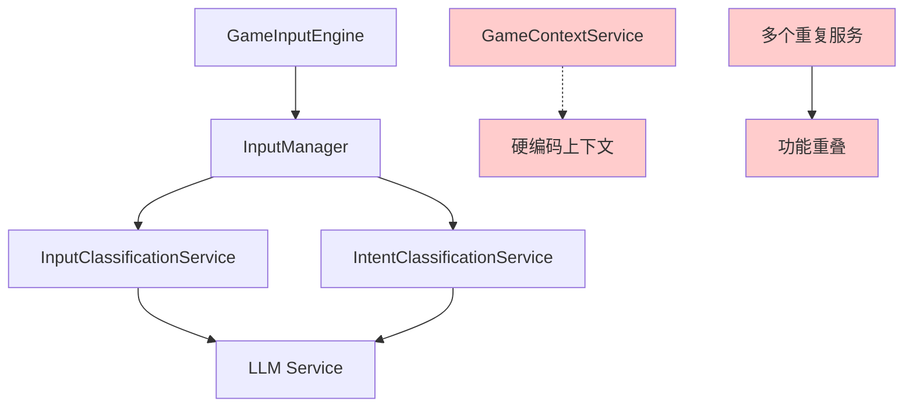
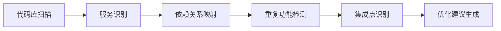
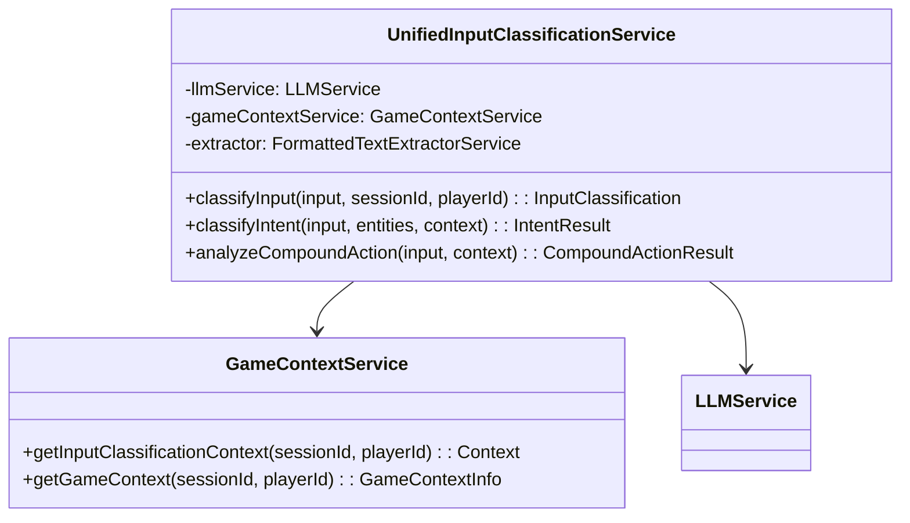
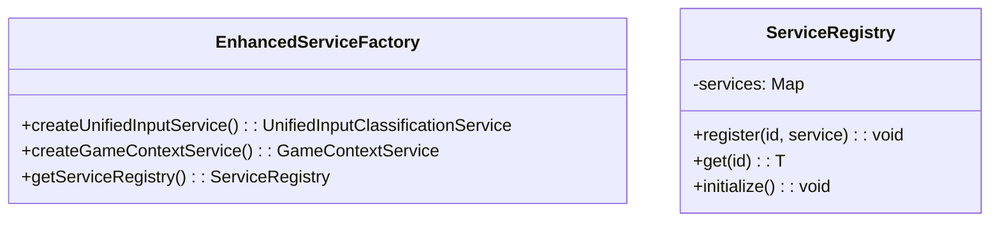
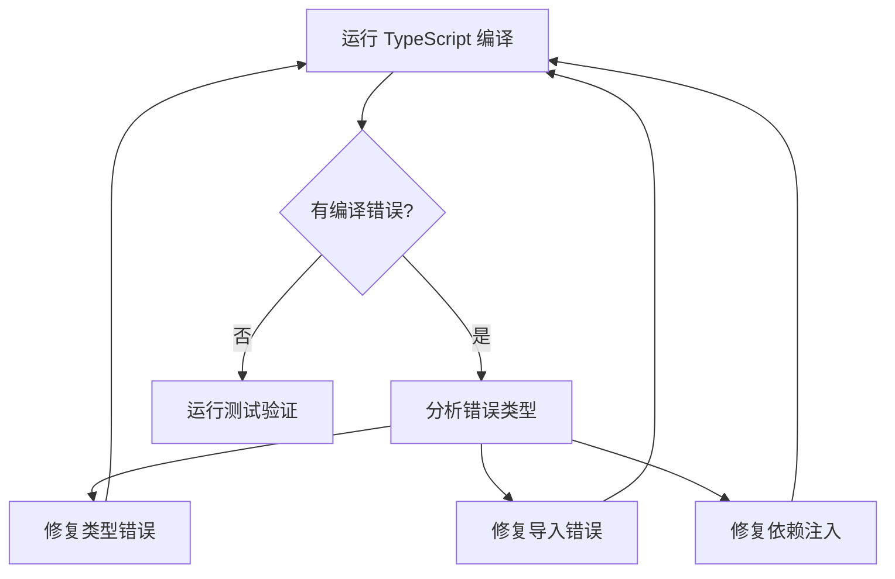

# 系统诊断与集成方案

## 概述

本文档提供了AI角色驱动开放世界游戏项目的全面系统诊断和集成方案。通过深入分析现有代码库，识别出多个关键问题：服务重复实现、硬编码上下文、集成不一致等。本方案将系统化地解决这些问题，实现高内聚、低耦合的架构设计。

## 架构现状分析

### 1. 项目架构概览



### 2. 识别的核心问题

#### 问题 A：输入分类服务重复实现
**位置**：
- `/src/services/input/InputClassificationService.ts`
- `/src/services/input/RealInputClassificationService.ts`
- `/src/services/input/InputService.ts`
- `/src/domains/input/services.ts` 中的 `IntentClassificationService`

**问题描述**：多个服务实现相似的输入分类功能，导致功能重叠和维护困难。

#### 问题 B：GameContextService 未被充分使用
**位置**：多个服务中使用硬编码上下文而非动态获取

**问题描述**：虽然 `GameContextService` 已实现完整的动态上下文获取功能，但系统中仍有大量硬编码上下文使用。

#### 问题 C：LLM 服务回退机制冗余
**位置**：多个服务中实现了 LLM 不可用时的回退逻辑

**问题描述**：根据项目原则，LLM 服务是游戏核心，不需要复杂的非 LLM 回退方案。

## 系统诊断流程

### 阶段 1：服务依赖关系分析



#### 1.1 输入分类服务诊断

**当前状态**：
- `InputClassificationService`: 基础实现，使用 FormattedTextExtractorService
- `RealInputClassificationService`: 高级实现，支持复合动作分析
- `IntentClassificationService`: 意图分类，在 input domain 中
- `InputService`: 简化版本，功能重叠

**建议整合方案**：
1. 保留 `RealInputClassificationService` 作为主要实现
2. 移除 `InputService` 和 `InputClassificationService`
3. 将 `IntentClassificationService` 功能整合到主服务中

#### 1.2 游戏上下文使用诊断

**未使用 GameContextService 的位置**：
- Input classification 中的硬编码上下文
- Character generation 中的固定角色列表
- Location services 中的静态位置数据

**建议改进**：
1. 统一使用 `GameContextService.getInputClassificationContext()`
2. 移除硬编码的角色和位置数据
3. 实现动态上下文获取机制

### 阶段 2：集成优化策略

#### 2.1 统一输入分类架构



#### 2.2 服务工厂模式改进



## 集成实施方案

### 第一步：服务整合与清理

#### 1.1 创建统一输入分类服务

**目标**：合并所有输入分类功能到单一服务

**实施计划**：
1. 创建 `UnifiedInputClassificationService`
2. 整合现有服务的最佳功能
3. 移除重复服务文件
4. 更新所有引用

#### 1.2 移除 LLM 回退机制

**目标**：简化 LLM 服务调用，移除非必要回退

**实施计划**：
1. 移除所有非 LLM 的分类回退逻辑
2. 保留基本错误处理
3. 优化 LLM 调用性能

### 第二步：游戏上下文集成

#### 2.1 硬编码上下文替换

**诊断检查表**：
- [ ] InputManager 中的硬编码位置
- [ ] Character services 中的固定角色列表
- [ ] Location services 中的静态数据
- [ ] Conversation history 的模拟数据

**集成步骤**：
1. 识别所有硬编码上下文使用
2. 替换为 GameContextService 调用
3. 添加适当的错误处理和回退
4. 验证动态上下文获取功能

#### 2.2 服务依赖注入优化

```typescript
// 目标架构
interface ServiceContainer {
  gameContextService: GameContextService;
  inputClassificationService: UnifiedInputClassificationService;
  llmService: LLMService;
  databaseService: DatabaseService;
}

// 统一的服务初始化
class ServiceInitializer {
  static async initialize(): Promise<ServiceContainer> {
    const gameContextService = new GameContextService(databaseService, logger);
    const inputService = new UnifiedInputClassificationService(
      llmService, 
      gameContextService, 
      logger
    );
    
    return { gameContextService, inputService, llmService, databaseService };
  }
}
```

### 第三步：代码质量与性能优化

#### 3.1 编译错误修复策略

**常见编译问题**：
1. 类型不匹配：服务接口变更导致的类型错误
2. 导入路径错误：服务文件移动/删除后的路径问题
3. 依赖注入问题：构造函数参数变更

**修复流程**：


#### 3.2 性能优化检查点

**优化目标**：
- 输入分类响应时间 < 800ms
- 上下文获取时间 < 200ms
- 内存使用优化 < 100MB

**检查项目**：
1. LLM 服务调用频率优化
2. 数据库查询性能优化
3. 缓存机制实现
4. 异步处理优化

## 质量保证与验证

### 验证检查清单

#### 功能验证
- [ ] 输入分类准确性保持不变
- [ ] 游戏上下文正确获取
- [ ] 服务依赖关系正确
- [ ] API 接口兼容性

#### 性能验证
- [ ] 响应时间符合目标
- [ ] 内存使用在合理范围
- [ ] 编译时间改善
- [ ] 错误率降低

#### 代码质量验证
- [ ] 无编译错误
- [ ] 无重复代码
- [ ] 服务职责清晰
- [ ] 依赖关系简化

### 测试策略

#### 单元测试更新
```typescript
describe('UnifiedInputClassificationService', () => {
  it('should classify input with game context', async () => {
    const mockGameContext = {
      sessionId: 'test-session',
      currentLocation: '图书馆',
      nearbyCharacters: ['图书管理员'],
      recentConversation: []
    };
    
    const result = await service.classifyInput(
      '我想找一本书',
      'test-session',
      'test-player'
    );
    
    expect(result.intent).toBe('inquiry');
    expect(result.confidence).toBeGreaterThan(0.8);
  });
});
```

#### 集成测试设计
```typescript
describe('System Integration', () => {
  it('should integrate all services without conflicts', async () => {
    const coordinator = new DomainCoordinator(llmService, logger, gameContextService);
    
    const result = await coordinator.processPlayerInput(
      'test-session',
      'test-player',
      '我想去市场买些东西',
      mockGameContext
    );
    
    expect(result.success).toBe(true);
    expect(result.gameStateUpdates).toBeDefined();
  });
});
```

## 风险评估与缓解

### 高风险项目
1. **服务重构导致的功能回退**
   - 缓解：逐步迁移，保留原服务直到验证完成
   
2. **GameContextService 数据库依赖**
   - 缓解：实现数据库连接失败的优雅降级
   
3. **编译时间增长**
   - 缓解：优化 TypeScript 配置，使用增量编译

### 中等风险项目
1. **性能回退**
   - 缓解：实施性能监控，设置性能基准
   
2. **API 兼容性问题**
   - 缓解：维护向后兼容的接口适配器

## 实施时间表

### 第一周：诊断与规划
- 完成代码库全面扫描
- 生成详细的重复服务清单
- 制定服务整合优先级

### 第二周：核心服务整合
- 实现 UnifiedInputClassificationService
- 移除重复服务
- 修复编译错误

### 第三周：上下文集成
- 替换所有硬编码上下文
- 集成 GameContextService
- 验证动态上下文功能

### 第四周：测试与优化
- 完成集成测试
- 性能优化
- 代码质量验证

## 长期维护建议

### 架构监控
1. 定期检查服务重复
2. 监控依赖关系复杂度
3. 跟踪性能指标

### 开发规范
1. 新服务必须通过架构审查
2. 禁止直接硬编码上下文
3. 统一使用 GameContextService

### 持续改进
1. 季度架构评估
2. 性能基准更新
3. 代码质量门禁

---

*本诊断方案旨在系统化解决项目中的集成问题，建立可维护、高性能的架构基础。*