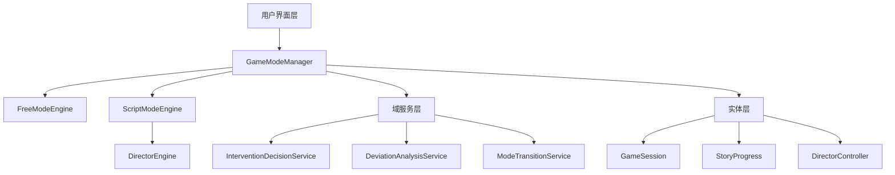

# 游戏模式系统使用指南

## 概述

游戏模式系统是AI角色驱动开放世界游戏的核心功能之一，提供了两种不同的游戏体验：**自由模式**和**剧本模式**。该系统基于领域驱动设计（DDD）架构实现，具有高度的可扩展性和可维护性。

## 系统架构

### 核心组件



### 主要组件说明

- **GameModeManager**: 游戏模式域的聚合根，统一管理所有游戏模式相关业务逻辑
- **FreeModeEngine**: 自由模式引擎，处理无约束的创意游戏体验
- **ScriptModeEngine**: 剧本模式引擎，配合导演系统实现引导式故事体验
- **DirectorEngine**: 智能导演引擎，监控玩家行为并适时进行干预

## 功能特性

### 自由模式 (Free Mode)

#### 特性
- ✨ 无剧情约束，完全自由的创意表达
- 🎭 动态角色和地点生成
- 🗺️ 适应性世界扩展
- 🎲 可配置的随机事件系统
- 🎨 个性化的创意评分系统

#### 配置选项
```typescript
interface FreeModeConfig {
  worldGenerationType: 'random' | 'guided' | 'custom';
  characterCreationEnabled: boolean;
  locationAccessLevel: 'unrestricted' | 'guided' | 'limited';
  eventRandomness: number; // 0-100
  creativeFreedom: number; // 0-100
}
```

### 剧本模式 (Script Mode)

#### 特性
- 📚 精心设计的故事情节
- 🎬 智能导演系统引导
- ⚖️ 可调节的偏离容忍度
- 🎯 明确的故事目标和结局
- 📊 实时的故事进展追踪

#### 配置选项
```typescript
interface ScriptModeConfig {
  storyOutlineId: string;
  directorInterventionLevel: number; // 0-100
  storyDeviationTolerance: number; // 0-100
  targetStoryLength: number; // 分钟
  keyPlotPoints: PlotPoint[];
  allowPlayerDeviations: boolean;
}
```

## 导演系统

### 干预机制

导演系统会根据玩家行为的偏离程度进行不同强度的干预：

| 偏离程度 | 干预类型 | 干预强度 | 实施方式 |
|----------|----------|----------|----------|
| 0-30% | 无干预 | 0% | 自然推进 |
| 30-50% | 信息引导 | 25% | 对话暗示、选项调整 |
| 50-70% | 事件引导 | 50% | 生成相关事件、NPC介入 |
| 70-85% | 强制引导 | 75% | 环境限制、强制事件 |
| 85-100% | 紧急纠正 | 100% | 剧情重置、直接干预 |

### 干预类型

1. **事件生成 (Event Generation)**: 创建新的故事事件来引导玩家
2. **对话引导 (Dialogue Guidance)**: 通过NPC对话提供暗示
3. **信息干扰 (Information Interference)**: 选择性提供或隐藏信息
4. **环境控制 (Environment Control)**: 通过环境变化影响玩家选择

## 快速开始

### 1. 初始化游戏模式管理器

```typescript
import { GameModeManager } from './domains/gameMode/aggregates';
import { LLMService } from './services/llm/LLMService';
import { Logger } from './services/Logger';

const llmService = new LLMService();
const logger = new Logger();
const gameModeManager = new GameModeManager(llmService, logger);
```

### 2. 配置自由模式

```typescript
import { GameModeType, FreeModeConfig, StoryGenre } from './domains/gameMode/valueObjects';

const freeModeConfig: FreeModeConfig = {
  worldGenerationType: 'random',
  characterCreationEnabled: true,
  locationAccessLevel: 'unrestricted',
  eventRandomness: 70,
  creativeFreedom: 80
};

const playerPreferences = {
  preferredGenre: StoryGenre.FANTASY,
  difficultyLevel: 50,
  narrativeStyle: 'descriptive',
  interactionFrequency: 'medium',
  allowMatureContent: false,
  languagePreference: 'zh-CN'
};

const config = {
  mode: GameModeType.FREE,
  sessionId: 'your-session-id',
  worldSeed: 'unique-world-seed',
  playerPreferences,
  modeSpecificConfig: freeModeConfig
};

const result = await gameModeManager.initializeGameMode(config, 'player-id');
```

### 3. 配置剧本模式

```typescript
const scriptModeConfig: ScriptModeConfig = {
  storyOutlineId: 'mystery-artifact',
  directorInterventionLevel: 60,
  storyDeviationTolerance: 40,
  targetStoryLength: 120,
  keyPlotPoints: [],
  allowPlayerDeviations: true
};

const config = {
  mode: GameModeType.SCRIPT,
  sessionId: 'your-session-id',
  worldSeed: 'unique-world-seed',
  playerPreferences,
  modeSpecificConfig: scriptModeConfig
};

const result = await gameModeManager.initializeGameMode(config, 'player-id');
```

### 4. 处理玩家行动

```typescript
const response = await gameModeManager.processPlayerAction(
  'player-id',
  '我想要探索神秘的森林',
  { 
    location: 'town_square',
    targetCharacter: null 
  }
);

console.log(response.responseText);

// 剧本模式下检查干预信息
if (response.interventionApplied) {
  console.log('导演干预:', response.interventionDetails);
}
```

### 5. 模式切换

```typescript
// 从自由模式切换到剧本模式
const switchResult = await gameModeManager.switchMode(
  GameModeType.SCRIPT, 
  scriptModeConfig
);

if (switchResult.success) {
  console.log('模式切换成功');
  if (switchResult.warnings) {
    console.log('警告:', switchResult.warnings);
  }
}
```

## UI组件使用

### 游戏模式选择组件

```typescript
import { GameModeSelection } from './ui/GameModeSelection';

function App() {
  const handleModeSelected = (mode: GameModeType, config: any) => {
    // 处理模式选择
    gameModeManager.initializeGameMode({
      mode,
      sessionId: generateSessionId(),
      worldSeed: generateWorldSeed(),
      playerPreferences: getPlayerPreferences(),
      modeSpecificConfig: config
    }, getCurrentPlayerId());
  };

  return (
    <GameModeSelection 
      onModeSelected={handleModeSelected}
      onCancel={() => console.log('取消选择')}
    />
  );
}
```

### 游戏状态显示组件

```typescript
import { GameModeStatus } from './ui/GameModeStatus';

function GameInterface() {
  const modeState = gameModeManager.getCurrentModeState();
  const storyProgress = gameModeManager.getStoryProgress();
  const directorStats = gameModeManager.getDirectorStats();

  return (
    <GameModeStatus
      currentMode={modeState.currentMode}
      modeState={modeState}
      storyProgress={storyProgress}
      directorStats={directorStats}
      onModeSwitch={() => setShowModeSelection(true)}
    />
  );
}
```

## 最佳实践

### 1. 模式选择建议

- **新手玩家**: 推荐剧本模式，中等干预强度（50-70%）
- **有经验的玩家**: 自由模式或低干预剧本模式
- **创意写作者**: 自由模式，高创意自由度设置

### 2. 配置调优

#### 自由模式
- `eventRandomness`: 30-50% 适合注重故事连贯性的玩家
- `creativeFreedom`: 80-100% 适合喜欢实验性玩法的玩家

#### 剧本模式
- `directorInterventionLevel`: 根据玩家喜好调整
- `storyDeviationTolerance`: 新手建议30-40%，高级玩家可设60-80%

### 3. 性能优化

```typescript
// 使用缓存来提高响应速度
const cacheConfig = {
  enableDynamicContentCache: true,
  maxCacheSize: 1000,
  cacheExpirationTime: 3600000 // 1小时
};

// 批量处理多个行动
const batchActions = [
  '我查看周围环境',
  '我与守卫对话',
  '我走向城门'
];

for (const action of batchActions) {
  await gameModeManager.processPlayerAction(playerId, action, context);
}
```

## 故障排除

### 常见问题

1. **模式切换失败**
   - 检查当前会话状态
   - 确认配置参数有效性
   - 查看日志了解具体错误

2. **导演干预过于频繁**
   - 降低干预强度设置
   - 增加偏离容忍度
   - 检查玩家行为模式

3. **自由模式缺乏方向感**
   - 启用引导式世界生成
   - 适当降低创意自由度
   - 增加随机事件频率

### 调试技巧

```typescript
// 启用详细日志
const logger = new Logger();
logger.setLevel('debug');

// 获取内部状态用于调试
const modeState = gameModeManager.getCurrentModeState();
const storyProgress = gameModeManager.getStoryProgress();

console.log('当前模式状态:', modeState);
console.log('故事进展:', storyProgress);
```

## API参考

### GameModeManager 主要方法

- `initializeGameMode(config, playerId)`: 初始化游戏模式
- `switchMode(newMode, newConfig)`: 切换游戏模式
- `processPlayerAction(playerId, action, context)`: 处理玩家行动
- `getCurrentModeState()`: 获取当前模式状态
- `getStoryProgress()`: 获取故事进展（剧本模式）
- `getDirectorStats()`: 获取导演统计信息

### 事件监听

```typescript
// 监听模式切换事件
gameModeManager.on('modeSwitch', (fromMode, toMode) => {
  console.log(`模式从 ${fromMode} 切换到 ${toMode}`);
});

// 监听干预事件
gameModeManager.on('intervention', (interventionDetails) => {
  console.log('导演进行了干预:', interventionDetails);
});
```

## 扩展开发

### 添加新的游戏模式

1. 在 `valueObjects.ts` 中添加新的模式类型
2. 创建对应的配置接口
3. 实现模式引擎
4. 更新 GameModeManager 逻辑

### 自定义干预策略

```typescript
import { InterventionDecisionService } from './domains/gameMode/services';

class CustomInterventionService extends InterventionDecisionService {
  evaluateInterventionNeed(deviation, controller, progress, context) {
    // 自定义干预逻辑
    return super.evaluateInterventionNeed(deviation, controller, progress, context);
  }
}
```

## 更新日志

### v1.0.0 (当前版本)
- 实现基础的自由模式和剧本模式
- 智能导演系统
- 模式切换功能
- React UI组件
- 完整的单元测试覆盖

### 计划中的功能
- 合作模式（多人剧本）
- 竞技模式（PvP故事创作）
- 高级AI导演算法
- 更多预设故事模板
- 移动端适配

---

如有问题或建议，请参考项目的 GitHub Issues 或联系开发团队。