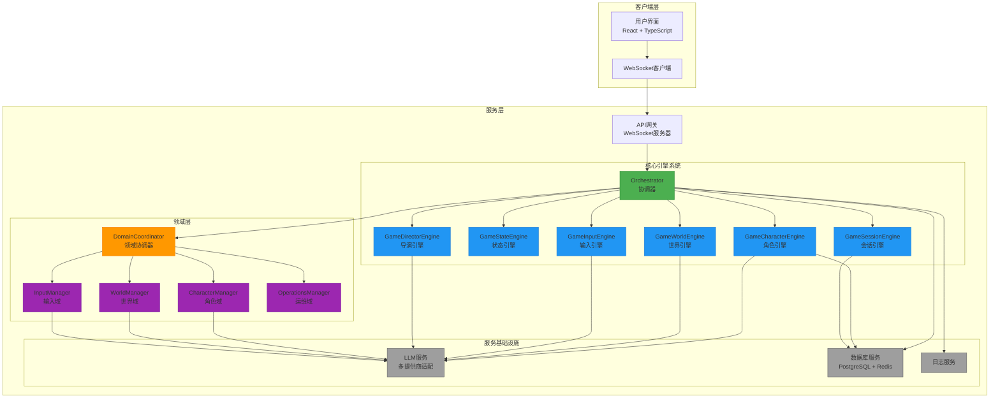
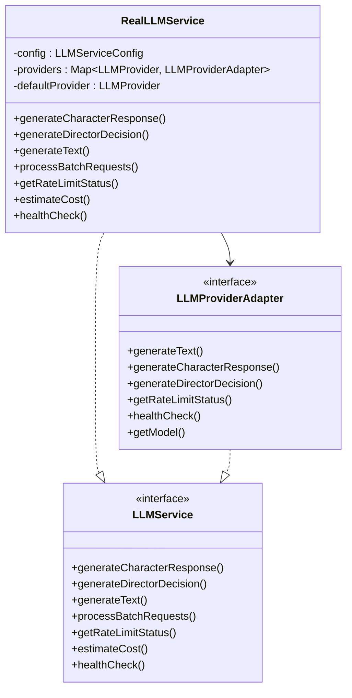
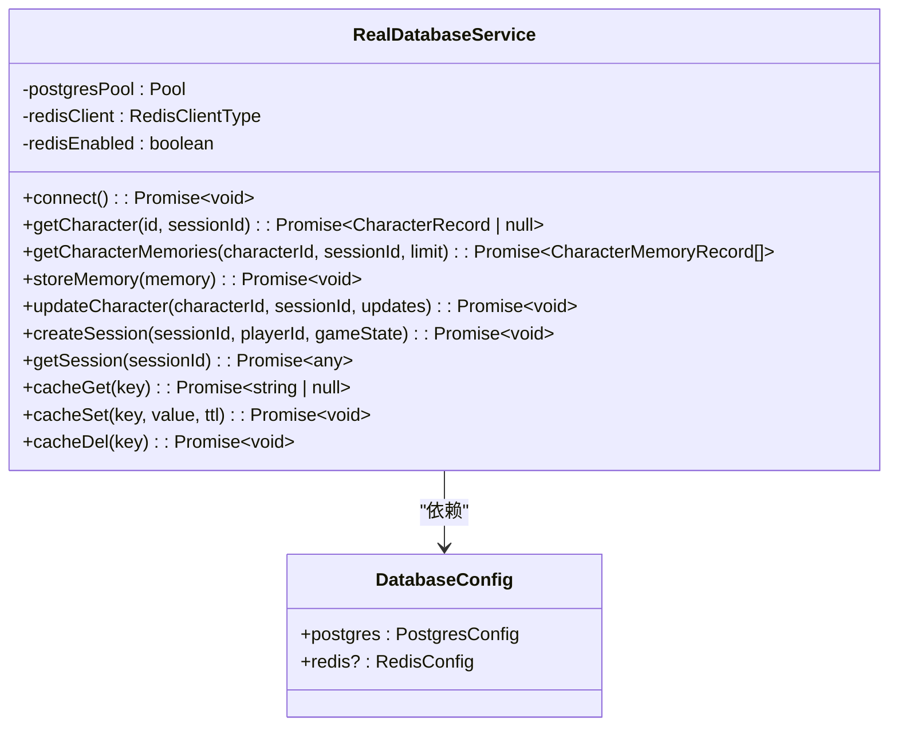
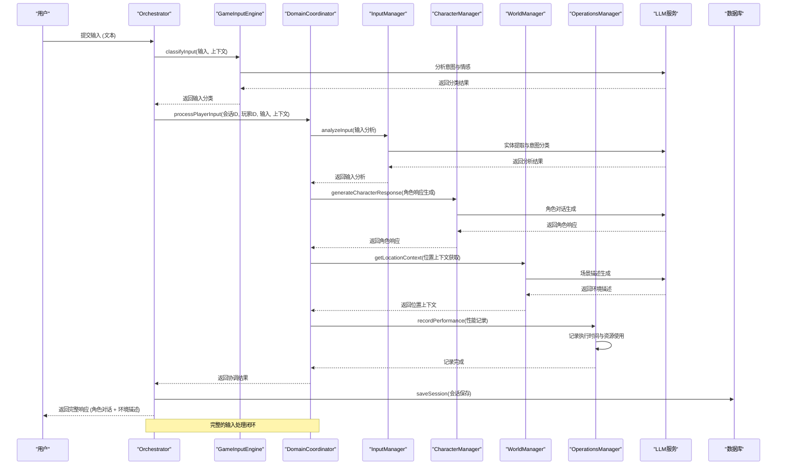

# AI角色驱动开放世界游戏

一个基于领域驱动设计(DDD)架构的AI角色驱动开放世界叙事游戏系统。本项目通过整合大型语言模型(LLM)、角色行为引擎、动态世界系统和**智能游戏模式系统**，创造了一个沉浸式的交互式叙事体验。

## 🚀 快速开始

### 一键启动

```bash
# 安装依赖
npm install

# 配置环境变量
cp .env.example .env
# 编辑 .env 文件，添加你的 API 密钥

# 启动完整游戏系统
npm run game
```

### Web界面体验

```bash
# 启动游戏服务器
npm run dev:server

# 在浏览器中打开 web-interface.html
# 开始你的AI冒险之旅！
```

### 快速测试

```bash
# 运行系统测试
npm run test:system

# 运行游戏流程示例
npm run dev:example
```

## 📋 详细文档

- **[快速启动指南](QUICK_START.md)** - 完整的安装和配置说明
- **[用户界面设计](UI_DESIGN.md)** - 界面设计说明
- **[游戏模式系统指南](GAME_MODE_GUIDE.md)** - 自由模式与剧本模式详细说明
- **[API参考文档](#)** - 开发者API文档

## 🌟 主要特性

- **🤖 智能AI角色**: 基于LLM的角色具有独特个性和记忆
- **🌍 动态开放世界**: 环境响应玩家行动的开放世界
- **🎮 双游戏模式**: 自由创作模式 + 智能导演剧本模式
- **🎬 智能导演系统**: 自适应故事引导，保持叙事连贯性
- **💬 自然语言交互**: 支持自由文本输入和对话
- **🔄 实时多用户**: WebSocket支持多玩家在线
- **🧠 多LLM支持**: OpenAI、Anthropic、Gemini等
- **📊 完整状态管理**: 持久化角色记忆和故事进展

## 系统架构

### 整体架构图



### 领域驱动设计架构

本项目采用领域驱动设计(DDD)架构，将系统划分为四个核心领域：

1. **角色域 (Character Domain)**
   - 负责管理所有与游戏角色相关的业务逻辑
   - 包含角色状态、记忆、情绪、人际关系和行为决策
   - 核心实体：Character（角色）
   - 聚合根：CharacterManager

2. **世界域 (World Domain)**
   - 负责管理游戏世界的结构、位置、场景和时间系统
   - 维护游戏环境的状态和动态变化
   - 核心实体：GameWorld, GameLocation, GameScene
   - 聚合根：WorldManager

3. **输入域 (Input Domain)**
   - 处理和分析玩家输入，进行意图识别、情感分析和上下文理解
   - 作为玩家与游戏世界交互的入口
   - 核心实体：InputSession, InputClassifier
   - 聚合根：InputManager

4. **运维域 (Operations Domain)**
   - 负责系统级操作，包括性能监控、错误记录、成本跟踪和系统维护
   - 提供跨领域的支持功能
   - 核心实体：PerformanceMonitor, CostTracker, ErrorTracker
   - 聚合根：OperationsManager

### 核心引擎系统

系统由六大核心引擎构成，每个引擎负责特定领域的逻辑处理：

- **GameSessionEngine**：管理游戏会话的创建、加载与保存
- **GameStateEngine**：维护全局游戏状态，包括场景、紧张度、剧情进度等
- **GameCharacterEngine**：驱动角色行为，生成基于LLM的角色响应
- **GameWorldEngine**：处理环境变化，如时间、天气、地点描述
- **GameInputEngine**：预处理用户输入，进行意图分类与上下文分析
- **GameDirectorEngine**：统筹叙事节奏，评估故事进展并生成导演决策

### LLM服务集成

系统支持多种LLM提供商，通过适配器模式实现统一接口：

- OpenAI (GPT系列)
- Anthropic (Claude系列)
- Google Gemini
- OpenRouter (多种模型)



### 数据持久化与存储

系统采用PostgreSQL作为主数据库，Redis作为缓存层，实现高性能数据访问：



## 游戏循环详解

### 完整游戏循环流程



### 详细节点说明

#### 1. 输入处理节点
**依赖服务：**
- GameInputEngine：输入预处理与分类
- InputManager：深入分析与实体提取
- LLMService：自然语言理解与意图识别

**接口调用：**
- `InputManager.analyzeInput()`：分析玩家输入的意图、情感和实体
- `LLMService.generateText()`：使用LLM进行语义分析

#### 2. 角色响应生成节点
**依赖服务：**
- CharacterManager：角色行为协调
- LLMService：角色对话生成
- DatabaseService：角色状态持久化

**接口调用：**
- `CharacterManager.generateCharacterResponse()`：生成基于角色个性和上下文的响应
- `DatabaseService.getCharacter()`：获取角色当前状态
- `DatabaseService.updateCharacter()`：更新角色状态

#### 3. 世界环境更新节点
**依赖服务：**
- WorldManager：世界状态管理
- LLMService：环境描述生成
- DatabaseService：世界状态持久化

**接口调用：**
- `WorldManager.getLocationContext()`：获取当前位置的完整上下文
- `WorldManager.processLocationMovement()`：处理位置变更
- `LLMService.generateText()`：生成动态环境描述

#### 4. 叙事统筹节点
**依赖服务：**
- OperationsManager：性能监控与成本跟踪
- StoryProgressionService：故事进展管理

**接口调用：**
- `OperationsManager.recordPerformance()`：记录操作性能指标
- `OperationsManager.recordCost()`：记录LLM调用成本
- `StoryProgressionService.evaluateTriggerableEvents()`：评估可触发的剧情事件

#### 5. 状态持久化节点
**依赖服务：**
- DatabaseService：数据持久化
- SessionRepository：会话管理

**接口调用：**
- `DatabaseService.updateSession()`：更新会话状态
- `DatabaseService.storeConversation()`：存储对话记录
- `DatabaseService.storeMemory()`：存储角色记忆