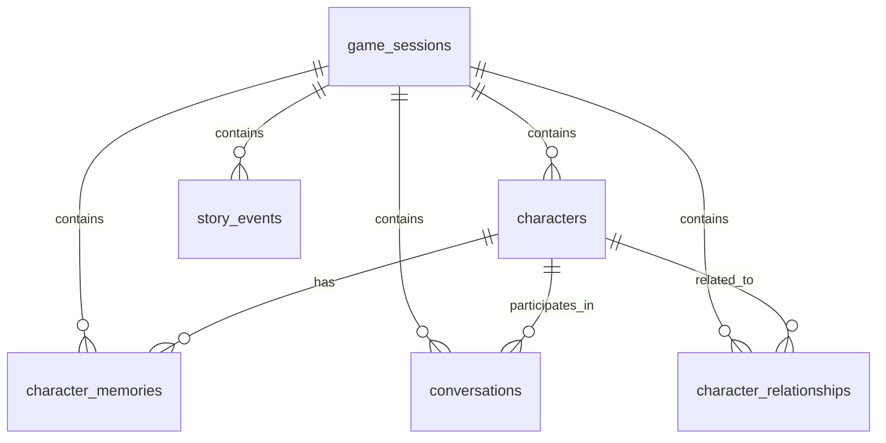

# 数据模型设计文档

## 1. 概述

本文档详细描述了AI角色驱动开放世界游戏的数据模型设计，包括各个数据表的结构、字段说明、关系以及使用场景。

## 2. 数据库表结构

### 2.1 游戏会话表 (game_sessions)

存储游戏会话信息，每个玩家的游戏进程对应一个会话。

| 字段名 | 类型 | 约束 | 描述 |
|--------|------|------|------|
| id | VARCHAR(36) | PRIMARY KEY | 会话唯一标识符(UUID) |
| created_at | TIMESTAMP | DEFAULT CURRENT_TIMESTAMP | 会话创建时间 |
| updated_at | TIMESTAMP | DEFAULT CURRENT_TIMESTAMP | 会话最后更新时间 |
| player_id | VARCHAR(36) | | 玩家标识符 |
| game_state | JSONB | | 游戏状态数据 |

### 2.2 角色表 (characters)

存储游戏中所有角色的信息，包括玩家创建的角色和AI角色。

| 字段名 | 类型 | 约束 | 描述 |
|--------|------|------|------|
| id | VARCHAR(36) | PRIMARY KEY | 角色唯一标识符(UUID) |
| session_id | VARCHAR(36) | REFERENCES game_sessions(id) | 所属会话ID |
| name | VARCHAR(100) | NOT NULL | 角色名称 |
| personality | JSONB | | 角色个性特征 |
| background | TEXT | | 角色背景故事 |
| current_location | VARCHAR(100) | | 角色当前位置 |
| emotional_state | JSONB | | 角色情感状态 |
| is_active | BOOLEAN | DEFAULT true | 角色是否激活 |
| character_data | JSONB | | 其他角色相关数据 |
| created_at | TIMESTAMP | DEFAULT CURRENT_TIMESTAMP | 角色创建时间 |
| updated_at | TIMESTAMP | DEFAULT CURRENT_TIMESTAMP | 角色最后更新时间 |

### 2.3 角色记忆表 (character_memories)

存储角色的记忆信息，包括对话、观察和行为等。

| 字段名 | 类型 | 约束 | 描述 |
|--------|------|------|------|
| id | VARCHAR(36) | PRIMARY KEY | 记忆唯一标识符(UUID) |
| character_id | VARCHAR(36) | REFERENCES characters(id) | 所属角色ID |
| session_id | VARCHAR(36) | REFERENCES game_sessions(id) | 所属会话ID |
| content | TEXT | NOT NULL | 记忆内容 |
| emotional_weight | NUMERIC(3,2) | | 情感权重(0-1) |
| associated_characters | TEXT[] | | 关联的角色列表 |
| tags | TEXT[] | | 记忆标签 |
| memory_type | VARCHAR(20) | CHECK (memory_type IN ('dialogue', 'observation', 'action')) | 记忆类型 |
| significance | INTEGER | | 重要性等级(1-10) |
| created_at | TIMESTAMP | DEFAULT CURRENT_TIMESTAMP | 记忆创建时间 |
| updated_at | TIMESTAMP | DEFAULT CURRENT_TIMESTAMP | 记忆最后更新时间 |

### 2.4 对话表 (conversations)

存储游戏中的对话记录。

| 字段名 | 类型 | 约束 | 描述 |
|--------|------|------|------|
| id | VARCHAR(36) | PRIMARY KEY | 对话记录唯一标识符(UUID) |
| session_id | VARCHAR(36) | REFERENCES game_sessions(id) | 所属会话ID |
| character_id | VARCHAR(36) | REFERENCES characters(id) | 相关角色ID |
| message_type | VARCHAR(20) | CHECK (message_type IN ('player_input', 'character_response', 'narration', 'system_message')) | 消息类型 |
| content | TEXT | NOT NULL | 对话内容 |
| context | JSONB | | 对话上下文 |
| created_at | TIMESTAMP | DEFAULT CURRENT_TIMESTAMP | 对话创建时间 |
| updated_at | TIMESTAMP | DEFAULT CURRENT_TIMESTAMP | 对话最后更新时间 |

### 2.5 角色关系表 (character_relationships)

存储角色之间的关系信息。

| 字段名 | 类型 | 约束 | 描述 |
|--------|------|------|------|
| id | VARCHAR(36) | PRIMARY KEY | 关系唯一标识符(UUID) |
| character_id | VARCHAR(36) | REFERENCES characters(id) | 角色ID |
| target_character_id | VARCHAR(36) | REFERENCES characters(id) | 目标角色ID |
| relationship_type | VARCHAR(50) | | 关系类型(如朋友、敌人、家人等) |
| strength | NUMERIC(3,2) | | 关系强度(0-1) |
| relationship_data | JSONB | | 其他关系数据 |
| session_id | VARCHAR(36) | REFERENCES game_sessions(id) | 所属会话ID |
| created_at | TIMESTAMP | DEFAULT CURRENT_TIMESTAMP | 关系创建时间 |
| updated_at | TIMESTAMP | DEFAULT CURRENT_TIMESTAMP | 关系最后更新时间 |

### 2.6 故事事件表 (story_events)

存储游戏中的重要故事事件。

| 字段名 | 类型 | 约束 | 描述 |
|--------|------|------|------|
| id | VARCHAR(36) | PRIMARY KEY | 事件唯一标识符(UUID) |
| session_id | VARCHAR(36) | REFERENCES game_sessions(id) | 所属会话ID |
| event_type | VARCHAR(50) | | 事件类型 |
| description | TEXT | | 事件描述 |
| location | VARCHAR(100) | | 事件发生位置 |
| involved_characters | TEXT[] | | 涉及的角色列表 |
| impact_level | INTEGER | | 影响等级(1-10) |
| story_data | JSONB | | 其他故事数据 |
| created_at | TIMESTAMP | DEFAULT CURRENT_TIMESTAMP | 事件创建时间 |
| updated_at | TIMESTAMP | DEFAULT CURRENT_TIMESTAMP | 事件最后更新时间 |

## 3. 数据模型关系图

## 4. 索引设计

为了提高查询性能，我们在以下字段上创建了索引：

1. `characters.session_id` - 提高按会话查询角色的性能
2. `character_memories.character_id` - 提高按角色查询记忆的性能
3. `character_memories.session_id` - 提高按会话查询记忆的性能
4. `character_memories.created_at` - 提高按时间查询记忆的性能
5. `conversations.session_id` - 提高按会话查询对话的性能
6. `conversations.character_id` - 提高按角色查询对话的性能
7. `conversations.created_at` - 提高按时间查询对话的性能
8. `character_relationships.character_id` - 提高按角色查询关系的性能
9. `character_relationships.session_id` - 提高按会话查询关系的性能
10. `story_events.session_id` - 提高按会话查询事件的性能
11. `story_events.created_at` - 提高按时间查询事件的性能

## 5. 数据访问模式

### 5.1 角色数据访问

- 通过会话ID获取所有活跃角色
- 通过角色ID和会话ID获取特定角色
- 更新角色信息
- 创建新角色

### 5.2 记忆数据访问

- 通过角色ID和会话ID获取角色记忆（按时间倒序）
- 存储新记忆
- 根据记忆类型和标签查询记忆

### 5.3 对话数据访问

- 通过角色ID和会话ID获取对话历史（按时间倒序）
- 存储新对话记录

### 5.4 关系数据访问

- 通过角色ID和会话ID获取角色关系
- 存储或更新角色关系

### 5.5 故事事件数据访问

- 通过会话ID获取故事事件（按时间倒序）
- 存储新故事事件

## 6. 缓存策略

为了提高性能，我们使用Redis缓存以下数据：

1. 角色信息 - 缓存5分钟
2. 角色记忆 - 缓存2分钟
3. 角色对话 - 缓存2分钟
4. 角色关系 - 缓存5分钟
5. 会话角色列表 - 缓存5分钟
6. 故事事件 - 缓存2分钟

当数据更新时，相关缓存会被自动清除以保证数据一致性。